# System Architecture

**VHealth Backend - Technical Architecture Documentation**

Last Updated: 2025-11-30 (Phase 2: Microservices Extraction)

---

## Table of Contents

1. [Architecture Overview](#1-architecture-overview)
2. [High-Level System Design](#2-high-level-system-design)
3. [Component Architecture](#3-component-architecture)
4. [Data Flow Architecture](#4-data-flow-architecture)
5. [Infrastructure Architecture](#5-infrastructure-architecture)
6. [Security Architecture](#6-security-architecture)
7. [Performance Architecture](#7-performance-architecture)
8. [Deployment Architecture](#8-deployment-architecture)
9. [Integration Architecture](#9-integration-architecture)
10. [Monitoring & Observability](#10-monitoring--observability)

---

## 1. Architecture Overview

### 1.1 Architecture Principles

VHealth Backend follows these architectural principles:

1. **Layered Architecture**: Clear separation of concerns (API → Service → Repository → Database)
2. **Async-First**: Non-blocking I/O throughout the application
3. **Cloud-Native**: Designed for serverless deployment on Google Cloud Run
4. **Stateless**: No session state in application layer
5. **Scalable**: Horizontal scaling with auto-scaling
6. **Resilient**: Graceful degradation and error handling
7. **Observable**: Comprehensive logging and metrics
8. **Secure**: Defense in depth security model

### 1.2 Microservices Architecture Overview (Phase 2)

VHealth Backend has successfully completed **Phase 2 of microservices extraction**, transitioning from a monolithic service architecture to a fully implemented microservices architecture with independently deployable services.

#### Phase 2 Achievements

**✅ Completed Services:**
- **Chat AI Service**: Standalone microservice with SBERT and OpenAI integration
- **Main API Service**: Core backend service with user management and conversations
- **Service-to-Service Communication**: IAM-based authentication and REST API integration
- **ONNX Optimization**: 2.5x faster inference for Vietnamese SBERT model
- **Production Infrastructure**: Docker, Cloud Run, CI/CD pipeline, monitoring

#### Phase 1 Foundation

**✅ Completed Components:**
- **Shared Package Infrastructure** (`app/core/shared/`)
- **Service Interface Contracts** (`app/interfaces/`)
- **Dependency Injection Container**
- **Service Decomposition** (Q&A, Email services)
- **Import Migration** (30/44 files)
- **Backward Compatibility** (Facade patterns)
- **Comprehensive Testing** (214/214 tests passed)
- **Code Review Excellence** (0 critical issues)

#### Microservices Architecture Pattern

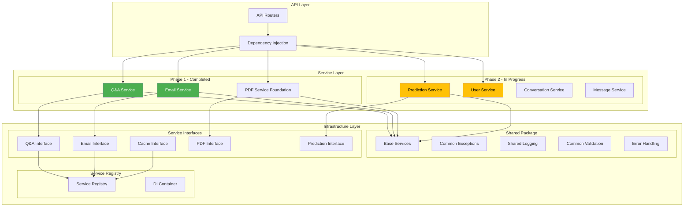

#### Key Architectural Principles

**1. Interface-Based Design**
- All services implement abstract interfaces
- Dependency injection through service registry
- Loose coupling between components
- Easy mocking and testing

**2. Shared Infrastructure**
- Common utilities in `app/core/shared/`
- Standardized error handling and logging
- Reusable validation and monitoring
- Consistent service patterns

**3. Backward Compatibility**
- Existing service imports continue to work
- Facade patterns maintain API stability
- Gradual migration path for existing code
- No breaking changes to external consumers

**4. Component Decomposition**
- Large services broken into focused components
- Single responsibility principle per component
- Facade pattern for backward compatibility
- Improved testability and maintainability

### 1.3 Technology Stack Summary

```
Frontend (Not included)
         ↓
    Load Balancer
         ↓
┌────────────────────────────────┐
│     Google Cloud Run           │
│   (VHealth Backend API)        │
│   - FastAPI 0.115.0            │
│   - Python 3.13                │
│   - Uvicorn ASGI Server        │
│   - Microservices Architecture  │
└────────────────────────────────┘
         ↓
    ┌────────┴────────┐
    ↓                 ↓
┌─────────┐    ┌──────────────┐
│ Cloud   │    │ Memorystore  │
│ SQL     │    │ (Redis)      │
│(Postgres│    │              │
│ 15+)    │    └──────────────┘
└─────────┘
    ↓
┌─────────────────────────────┐
│  External Services           │
│  - OpenAI API (GPT-4o-mini) │
│  - Google OAuth             │
│  - Cloud Storage (GCS)      │
│  - Secret Manager           │
└─────────────────────────────┘
```

---

## 2. High-Level System Design

### 2.1 System Context Diagram

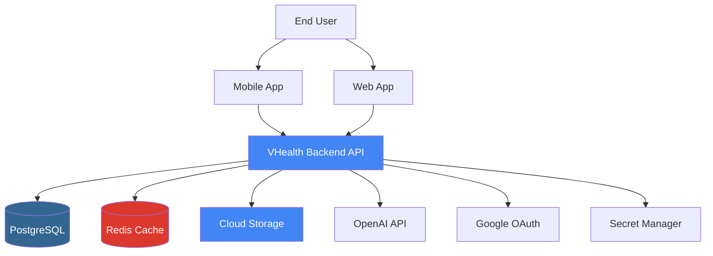

### 2.2 Container Diagram

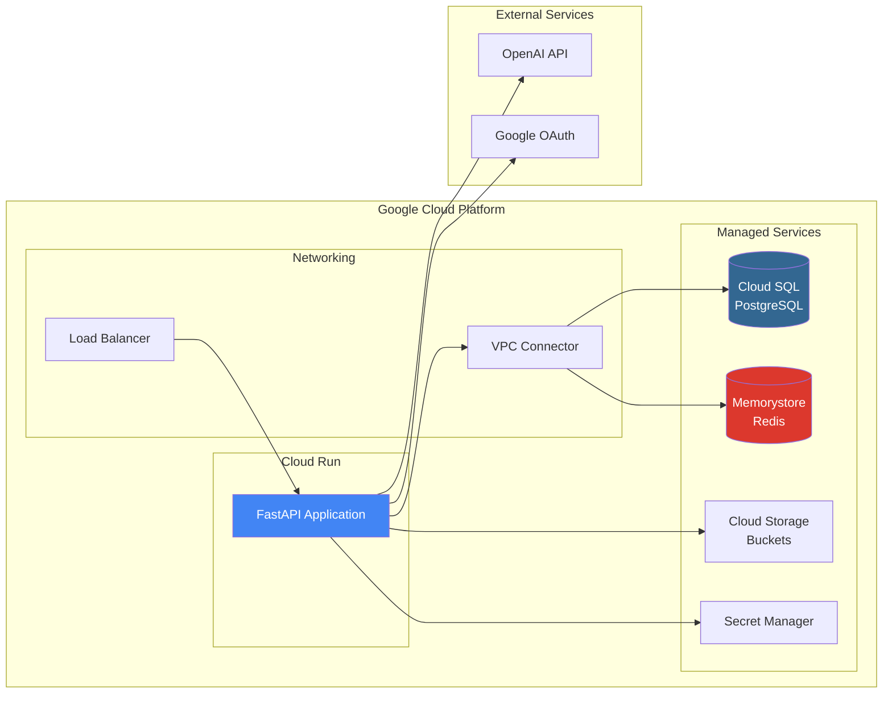

### 2.3 System Components

| Component | Technology | Purpose |
|-----------|-----------|---------|
| **API Server** | FastAPI + Uvicorn | HTTP/WebSocket endpoints |
| **Database** | PostgreSQL 15+ | Primary data store |
| **Cache** | Redis 5.0+ | Performance optimization |
| **Storage** | Google Cloud Storage | File and model storage |
| **Secrets** | Secret Manager | Secure secret storage |
| **ML Models** | SBERT, scikit-learn | Semantic search and predictions |
| **AI Service** | OpenAI API | Text generation and summarization |
| **Auth Provider** | Google OAuth | Social authentication |
| **Container Registry** | Artifact Registry | Docker image storage |
| **IaC** | Terraform | Infrastructure management |

---

## 3. Component Architecture

### 3.1 Layered Architecture with Microservices

```
┌─────────────────────────────────────────┐
│         API Layer (app/api/)            │  HTTP endpoints, validation
│  - FastAPI routers                      │  Request/response handling
│  - Request validation (Pydantic)        │  OpenAPI documentation
│  - Response serialization               │
│  - Dependency injection                  │
└─────────────────────────────────────────┘
              ↓
┌─────────────────────────────────────────┐
│   Service Registry & DI Container       │  NEW - Phase 1
│  - Interface-based resolution           │  Service lifecycle management
│  - Runtime dependency injection        │  Service registration
│  - Interface contracts                  │
└─────────────────────────────────────────┘
              ↓
┌─────────────────────────────────────────┐
│      Service Layer (app/services/)      │  Business logic
│  - Microservices components (Phase 1)  │  External integrations
│  - Interface-based communication        │  Shared infrastructure
│  - Business logic orchestration         │  Component isolation
│  - Integration with external services   │  Improved testability
│  - Data transformation                  │
└─────────────────────────────────────────┘
              ↓
┌─────────────────────────────────────────┐
│    Shared Infrastructure (app/core/)    │  NEW - Phase 1
│  - Service interfaces (app/interfaces/) │  Common utilities
│  - Shared package (app/core/shared/)   │  Base services
│  - Error handling and logging           │  Validation patterns
│  - Monitoring utilities                 │  Dependency management
└─────────────────────────────────────────┘
              ↓
┌─────────────────────────────────────────┐
│    Repository Layer (app/db/)           │  Data access
│  - Raw SQL queries (asyncpg)            │  CRUD operations
│  - CRUD operations                      │  Transaction management
│  - Transaction management               │  Shared error handling
│  - Connection pool usage                │
└─────────────────────────────────────────┘
              ↓
┌─────────────────────────────────────────┐
│          Database (PostgreSQL)          │  Persistent storage
│  - Tables (users, conversations, etc.)  │  Full-text search
│  - Indexes and constraints              │  JSONB storage
│  - Full-text search (tsvector)          │
└─────────────────────────────────────────┘
```

### 3.2 Microservices Architecture (Phase 1)

#### 3.2.1 Completed Services

**Q&A Service (`app/services/qa/`)**
```
┌─────────────────────────────────────────┐
│          QAService Interface            │  Abstract contract
└─────────────────────────────────────────┘
              ↓ Facade Pattern
┌─────────────────────────────────────────┐
│          QAService Facade               │  Backward compatibility
│  - ask_question()                      │  Component orchestration
│  - ask_question_stream()               │  Interface implementation
└─────────────────────────────────────────┘
              ↓ Component Decomposition
┌─────────────────────────────────────────┐
│  5 Specialized Components             │  Single responsibility
│  - ModelLoader (SBERT management)     │  Component isolation
│  - DatasetLoader (Q&A data processing)│  Improved testability
│  - AISummarizer (OpenAI integration)  │  Reusable components
│  - QuestionHasher (Cache key generation)│  Clear boundaries
│  - Types (Type definitions)           │  Shared infrastructure
└─────────────────────────────────────────┘
```

**Email Service (`app/services/email/`)**
```
┌─────────────────────────────────────────┐
│        EmailService Interface           │  Abstract contract
└─────────────────────────────────────────┘
              ↓ Facade Pattern
┌─────────────────────────────────────────┐
│        EmailService Facade             │  Backward compatibility
│  - send_verification_email()           │  Component orchestration
│  - send_password_reset_email()        │  Interface implementation
│  - send_custom_email()                │
└─────────────────────────────────────────┘
              ↓ Component Decomposition
┌─────────────────────────────────────────┐
│  5 Specialized Components             │  Single responsibility
│  - SMTPClient (Connection management)  │  Component isolation
│  - TemplateRenderer (Jinja2 rendering)│  Improved testability
│  - EmailSender (Email composition)    │  Reusable components
│  - EmailTypes (Pydantic schemas)      │  Clear boundaries
│  - Templates (HTML template management)│  Shared infrastructure
└─────────────────────────────────────────┘
```

#### 3.2.2 Services In Progress (Phase 2)

**Prediction Service**
- Current: Monolithic (`app/services/predict_service.py`)
- Planned: Component decomposition (ML model, data processing, AI integration)
- Interface: `PredictionServiceInterface` (defined)

**User Service**
- Current: Monolithic (`app/services/user.py`)
- Planned: Component decomposition (authentication, profiles, OAuth)
- Interface: `UserServiceInterface` (planned)

**Conversation & Message Services**
- Current: Monolithic (`app/services/conversation.py`, `app/services/message.py`)
- Planned: Component decomposition (CRUD, search, versioning, WebSocket)
- Interface: To be defined

#### 3.2.3 Interface-Based Communication

**Service Contracts (`app/interfaces/`)**
```python
# Example interface definition
from abc import ABC, abstractmethod

class QAServiceInterface(ABC):
    @abstractmethod
    async def ask_question(self, question: str) -> Dict:
        pass

    @abstractmethod
    async def ask_question_stream(self, question: str) -> AsyncIterator:
        pass

# Service registration and usage
from app.interfaces import register_service, get_service

# Register implementation
register_service("qa_service", QAService, QAServiceInterface)

# Use interface
qa_service: QAServiceInterface = get_service("qa_service")
```

**Dependency Injection**
```python
# Constructor injection
class ConversationService:
    def __init__(
        self,
        qa_service: QAServiceInterface,
        cache_service: CacheServiceInterface,
        email_service: EmailServiceInterface
    ):
        # Interface-based dependencies
        self.qa_service = qa_service
        self.cache_service = cache_service
        self.email_service = email_service

# FastAPI dependency injection
from app.interfaces import get_service_interface

def get_qa_service() -> QAServiceInterface:
    return get_service_interface("qa_service")

@router.post("/ask")
async def ask_question(
    request: QARequest,
    qa_service: QAServiceInterface = Depends(get_qa_service)
):
    return await qa_service.ask_question(request.question)
```

### 3.2 Component Diagram

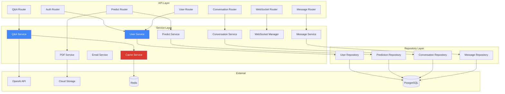

### 3.3 Key Services

#### 3.3.1 Q&A Service

**Responsibilities:**
- Load Vietnamese SBERT model
- Process Q&A dataset (Excel)
- Perform semantic search
- Integrate with OpenAI for summarization
- Stream responses via SSE
- Cache results

**Dependencies:**
- sentence-transformers (SBERT)
- OpenAI API
- Cache Service
- GCS (model download)

**Key Methods:**
```python
- ask(question: str) -> QAResponse
- ask_stream(question: str) -> AsyncGenerator[StreamEvent]
- _search(question: str) -> List[Dict]
- _summarize_with_ai(question: str, answers: List) -> str
- _ensure_model_and_data_exist() -> None
```

#### 3.3.2 Prediction Service

**Responsibilities:**
- Load obesity prediction models
- Calculate health metrics (BMI, metabolic age)
- Predict obesity risk levels
- Generate AI recommendations
- Store predictions in database

**Dependencies:**
- scikit-learn (model)
- OpenAI API
- Prediction Repository
- GCS (model download)

**Key Methods:**
```python
- predict(user_input: UserInput) -> PredictionResponse
- _calculate_bmi(weight: float, height: float) -> float
- _calculate_metabolic_age(...) -> int
- _generate_diet_plan(prediction: Dict) -> DietPlan
- _generate_workout_plan(prediction: Dict) -> WorkoutPlan
```

#### 3.3.3 PDF Service

**Responsibilities:**
- Render Jinja2 templates
- Generate PDFs with WeasyPrint
- Upload to Cloud Storage
- Provide public URLs

**Dependencies:**
- WeasyPrint
- Jinja2
- GCS Uploader
- Prediction Repository

**Key Methods:**
```python
- generate_and_upload_pdf(prediction_id: str) -> str
- _generate_pdf_bytes(prediction: Dict) -> bytes
- _render_template(template: str, context: Dict) -> str
```

#### 3.3.4 Cache Service

**Responsibilities:**
- Manage Redis connections
- Key-value operations with TTL
- Cache invalidation
- Statistics and monitoring
- Graceful degradation

**Key Methods:**
```python
- get(key: str) -> Optional[Any]
- set(key: str, value: Any, ttl: int) -> bool
- delete(key: str) -> bool
- ping() -> bool
- get_stats() -> Dict
```

#### 3.3.5 WebSocket Manager

**Responsibilities:**
- Manage WebSocket connections
- Broadcast messages to conversations
- Track connection health
- Cleanup stale connections

**Key Methods:**
```python
- connect(user_id: int, conversation_id: int, websocket: WebSocket)
- disconnect(user_id: int, conversation_id: int)
- broadcast(conversation_id: int, message: Dict)
- cleanup_stale_connections()
```

---

## 4. Data Flow Architecture

### 4.1 Q&A Request Flow

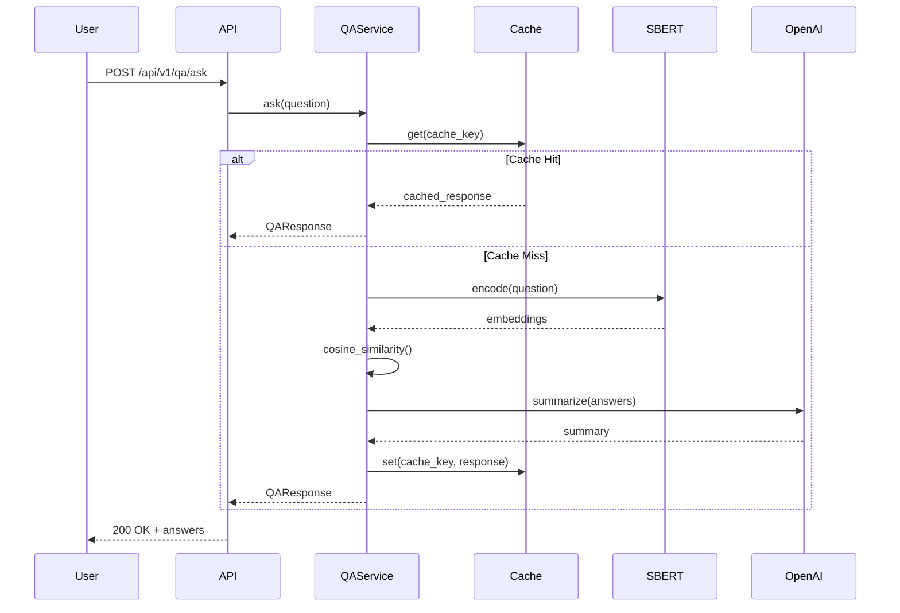

### 4.2 Health Prediction Flow

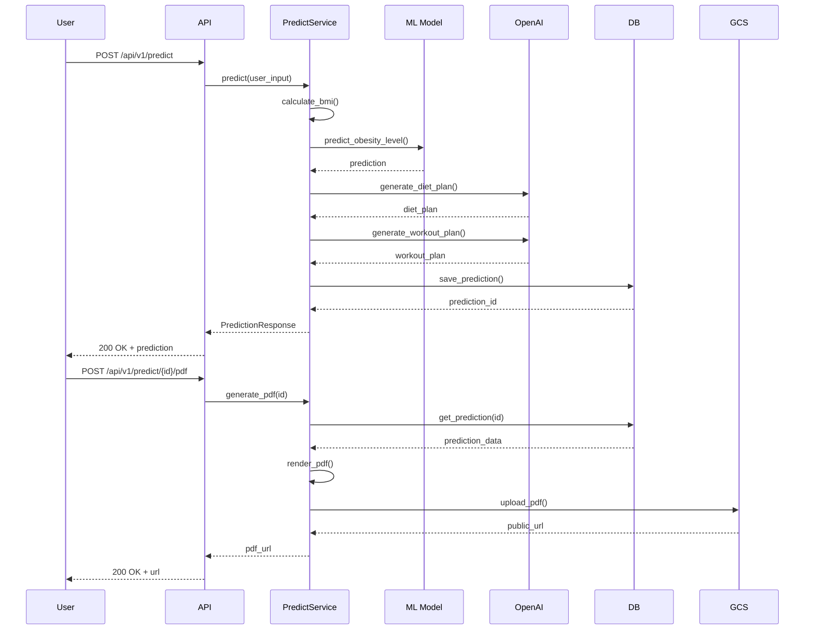

### 4.3 Authentication Flow

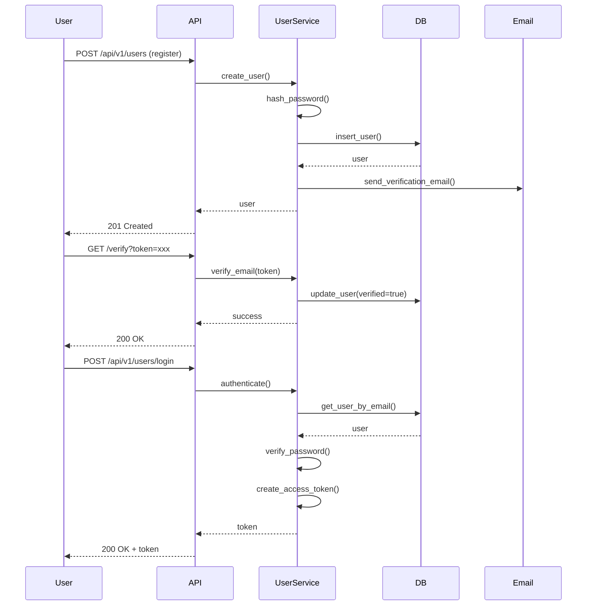

### 4.4 Real-Time Chat Flow

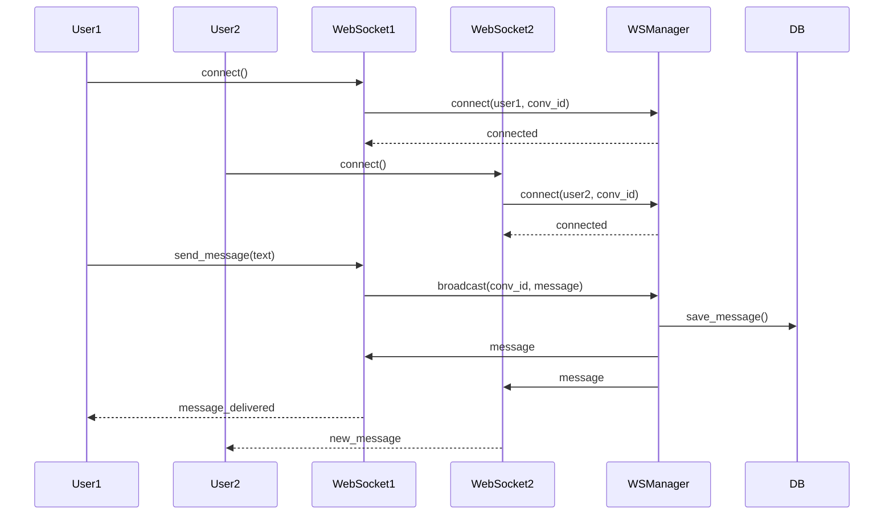

---

## 5. Infrastructure Architecture

### 5.1 Google Cloud Platform Architecture

```
┌─────────────────────────────────────────────────────────┐
│                  Google Cloud Platform                   │
│                                                           │
│  ┌────────────────────────────────────────────────────┐ │
│  │              Global Load Balancer                   │ │
│  └──────────────────────┬───────────────────────────────┘ │
│                         ↓                                 │
│  ┌────────────────────────────────────────────────────┐ │
│  │              Cloud Run (Auto-scaling)               │ │
│  │  ┌──────────┐  ┌──────────┐  ┌──────────┐         │ │
│  │  │ Instance │  │ Instance │  │ Instance │  ...    │ │
│  │  │    1     │  │    2     │  │    3     │         │ │
│  │  └──────────┘  └──────────┘  └──────────┘         │ │
│  └──────────────────────┬───────────────────────────────┘ │
│                         ↓                                 │
│  ┌───────────────────────────────────┐                   │
│  │     Serverless VPC Connector      │                   │
│  └──────────────────────┬────────────┘                   │
│                         ↓                                 │
│  ┌──────────────────┬──────────────┬────────────────┐   │
│  ↓                  ↓              ↓                ↓   │
│  ┌──────────┐  ┌──────────┐  ┌──────────┐  ┌──────────┐│
│  │ Cloud    │  │Memorystore│  │  Cloud   │  │ Secret   ││
│  │   SQL    │  │  (Redis)  │  │ Storage  │  │ Manager  ││
│  │(Postgres)│  │           │  │  (GCS)   │  │          ││
│  └──────────┘  └──────────┘  └──────────┘  └──────────┘│
│                                                           │
│  ┌────────────────────────────────────────────────────┐ │
│  │            Artifact Registry                        │ │
│  │         (Docker Images: base, app)                 │ │
│  └────────────────────────────────────────────────────┘ │
│                                                           │
│  ┌────────────────────────────────────────────────────┐ │
│  │           Cloud Scheduler                           │ │
│  │      (Scheduled health checks, cleanup)            │ │
│  └────────────────────────────────────────────────────┘ │
└─────────────────────────────────────────────────────────┘

External Services:
├── OpenAI API (GPT-4o-mini)
├── Google OAuth
└── SMTP (Email)
```

### 5.2 Infrastructure Components

#### 5.2.1 Cloud Run Configuration

```yaml
Service: vhealth-backend-{env}
Platform: Managed
Region: asia-southeast1
Concurrency: 80 requests per instance
Min Instances: 1
Max Instances: 10
CPU: 1 vCPU
Memory: 2 GB
Timeout: 300s (5 minutes)
Ingress: All
Authentication: Allow unauthenticated
```

#### 5.2.2 Cloud SQL Configuration

```yaml
Database: Cloud SQL for PostgreSQL
Version: PostgreSQL 15
Tier: db-g1-small (1 vCPU, 1.7 GB RAM) - dev
      db-custom-2-4096 (2 vCPU, 4 GB RAM) - prod
Storage: 10 GB SSD (auto-resize enabled)
Backups: Automated daily backups (7-day retention)
High Availability: Disabled (dev), Enabled (prod)
Private IP: Via VPC Connector
```

#### 5.2.3 Memorystore (Redis) Configuration

```yaml
Service: Memorystore for Redis
Version: Redis 7
Tier: Basic (dev), Standard (prod)
Memory: 1 GB (dev), 5 GB (prod)
Region: asia-southeast1
High Availability: Disabled (dev), Enabled (prod)
Persistence: RDB snapshots
Private IP: Via VPC Connector
```

#### 5.2.4 Cloud Storage Buckets

```yaml
Model Bucket: vhealth-{env}-models
- SBERT models
- Obesity prediction models
- Q&A datasets

Public Bucket: vhealth-{env}-public
- PDF reports
- User uploads
- Public access with signed URLs
```

### 5.3 Network Architecture

```
Internet
   ↓
Global Load Balancer (HTTPS)
   ↓
Cloud Run (asia-southeast1)
   ↓
Serverless VPC Connector
   ↓
┌──────────────────────────┐
│     Private Network      │
│  - Cloud SQL (Private IP)│
│  - Memorystore (Private) │
└──────────────────────────┘
```

---

## 6. Security Architecture

### 6.1 Security Layers

```
┌─────────────────────────────────────────────────┐
│           Application Security                   │
│  - JWT authentication                            │
│  - Password hashing (bcrypt)                     │
│  - Input validation (Pydantic)                   │
│  - SQL injection prevention (parameterized)      │
│  - Rate limiting                                 │
└─────────────────────────────────────────────────┘
                    ↓
┌─────────────────────────────────────────────────┐
│          Transport Security                      │
│  - HTTPS/TLS 1.2+ only                          │
│  - Security headers (HSTS, CSP, etc.)           │
│  - CORS configuration                            │
└─────────────────────────────────────────────────┘
                    ↓
┌─────────────────────────────────────────────────┐
│          Network Security                        │
│  - Private IPs for Cloud SQL, Redis             │
│  - VPC Connector for isolation                  │
│  - Firewall rules                                │
└─────────────────────────────────────────────────┘
                    ↓
┌─────────────────────────────────────────────────┐
│          Data Security                           │
│  - Encryption at rest (Cloud SQL, GCS)          │
│  - Encryption in transit (TLS)                  │
│  - Secret Manager for sensitive data            │
│  - Backup encryption                             │
└─────────────────────────────────────────────────┘
```

### 6.2 Authentication & Authorization Flow

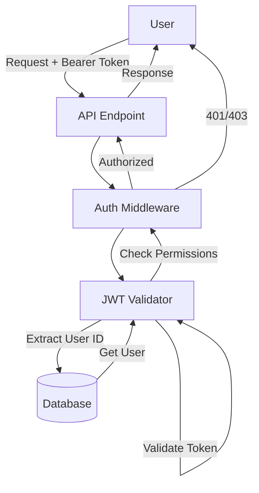

### 6.3 Security Best Practices

#### 6.3.1 Authentication
- JWT tokens with 30-minute expiration
- Refresh tokens with 30-day expiration
- Bcrypt password hashing (cost factor 12)
- Email verification required
- Password reset via secure tokens

#### 6.3.2 Authorization
- Role-based access control (RBAC)
- User roles: user, admin
- Admin-only endpoints protected
- Resource ownership validation

#### 6.3.3 Data Protection
- All passwords hashed with bcrypt
- Secrets stored in Secret Manager
- PII encrypted at rest
- No secrets in code or logs

#### 6.3.4 API Security
- HTTPS only (HTTP redirects to HTTPS)
- Rate limiting on sensitive endpoints
- CORS configured for allowed origins
- Security headers (HSTS, CSP, X-Frame-Options)

#### 6.3.5 Database Security
- Parameterized queries (SQL injection prevention)
- Connection pooling (resource management)
- Private IP access only
- Automated backups
- Point-in-time recovery

---

## 7. Performance Architecture

### 7.1 Performance Optimization Strategies

```
┌─────────────────────────────────────────────────┐
│         Application Level                        │
│  - Async/await for non-blocking I/O             │
│  - Connection pooling (1-20 connections)        │
│  - In-memory embeddings (SBERT)                 │
│  - Thread pools for CPU-bound tasks             │
│  - Background tasks for non-critical ops        │
└─────────────────────────────────────────────────┘
                    ↓
┌─────────────────────────────────────────────────┐
│          Caching Layer                           │
│  - Redis caching (40-70% latency reduction)     │
│  - Q&A answers cached (30 min TTL)              │
│  - Conversation lists cached (5 min TTL)        │
│  - User profiles cached (10 min TTL)            │
│  - Smart cache invalidation                     │
└─────────────────────────────────────────────────┘
                    ↓
┌─────────────────────────────────────────────────┐
│          Database Level                          │
│  - Indexes on frequently queried columns        │
│  - Materialized views for search                │
│  - Connection pooling                            │
│  - Query optimization                            │
└─────────────────────────────────────────────────┘
                    ↓
┌─────────────────────────────────────────────────┐
│          Infrastructure Level                    │
│  - Cloud Run auto-scaling                       │
│  - Load balancing                                │
│  - CDN for static assets (future)               │
│  - Regional deployment                           │
└─────────────────────────────────────────────────┘
```

### 7.2 Performance Metrics

| Metric | Without Cache | With Cache | Improvement |
|--------|--------------|------------|-------------|
| **Q&A Response** | 2-5 seconds | <50ms | 95-98% |
| **Conversation List** | 100-200ms | <50ms | 50-75% |
| **User Profile** | 50-100ms | <20ms | 60-80% |
| **Database Query** | 10-50ms | - | - |
| **WebSocket Latency** | <100ms | - | - |

### 7.3 Caching Strategy

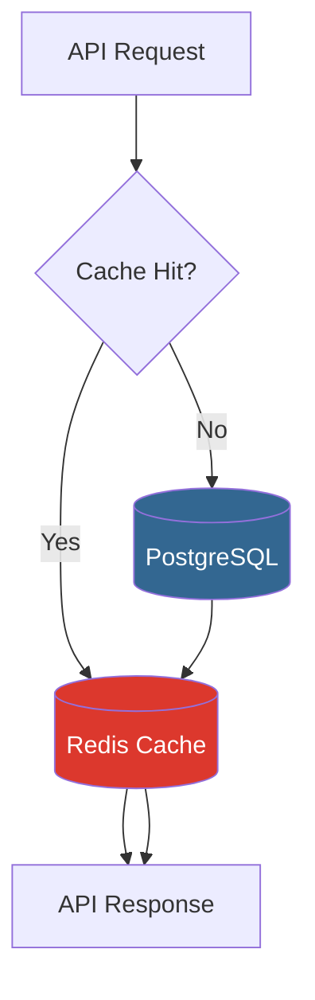

**Cache Keys:**
- `qa:answer:{question_hash}`: Q&A answers (30 min)
- `qa:summary:{content_hash}`: AI summaries (30 min)
- `conv:list:user:{user_id}`: Conversation lists (5 min)
- `conv:detail:{conversation_id}`: Conversation details (10 min)
- `user:profile:{user_id}`: User profiles (10 min)
- `msg:list:conv:{conversation_id}`: Message lists (3 min)

### 7.4 Scalability Patterns

#### 7.4.1 Horizontal Scaling
- Cloud Run auto-scales based on CPU/memory
- Min instances: 1 (dev), 2 (prod)
- Max instances: 10 (dev), 100 (prod)
- Stateless application design

#### 7.4.2 Database Scaling
- Connection pooling (1-20 connections)
- Read replicas (future)
- Query optimization with indexes
- Materialized views for search

#### 7.4.3 Cache Scaling
- Redis Memorystore (1 GB to 300 GB)
- Standard tier with HA (prod)
- Automatic failover
- Persistence with RDB snapshots

---

## 8. Deployment Architecture

### 8.1 CI/CD Pipeline

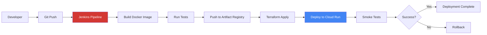

### 8.2 Deployment Stages

#### Stage 1: Build
```bash
1. Checkout code from Git
2. Build base image (if requirements changed)
   - CRITICAL: Must include fonts-dejavu-core and fonts-noto-core
   - Required for Vietnamese PDF generation in production
3. Build application image
   - Also includes Vietnamese font support
4. Tag with BUILD_NUMBER and GIT_COMMIT
5. Push to Artifact Registry
```

**Important Build Notes:**
- Both `Dockerfile` and `Dockerfile.base` must include Vietnamese fonts
- Missing fonts will cause PDF rendering failures in production
- Set `REBUILD_BASE_IMAGE=true` in Jenkins when updating Dockerfile.base

#### Stage 2: Infrastructure
```bash
1. Initialize Terraform
2. Plan infrastructure changes
3. Apply changes (if approved)
4. Output resource details
```

#### Stage 3: Deploy
```bash
1. Update Cloud Run service
2. Set new image
3. Configure environment variables
4. Set traffic to 100% (or canary)
5. Wait for deployment completion
```

#### Stage 4: Verify
```bash
1. Health check endpoint
2. Smoke tests
3. Monitor errors
4. Rollback if issues
```

### 8.3 Environment Configuration

#### Development Environment
```yaml
Environment: dev
Branch: develop
Domain: dev.vhealth.example.com
Database: db-g1-small
Redis: 1 GB Basic
Min Instances: 1
Max Instances: 10
Debug: true
```

#### Production Environment
```yaml
Environment: prod
Branch: main
Domain: api.vhealth.example.com
Database: db-custom-2-4096 (HA)
Redis: 5 GB Standard (HA)
Min Instances: 2
Max Instances: 100
Debug: false
```

### 8.4 Rollback Strategy

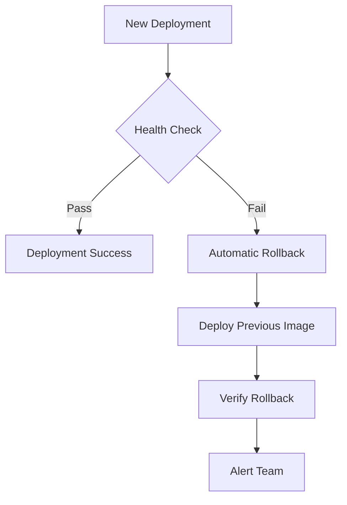

---

## 9. Integration Architecture

### 9.1 External Service Integrations

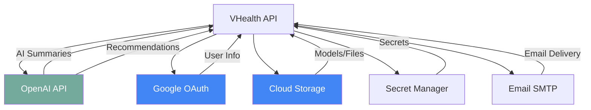

### 9.2 OpenAI Integration

**Purpose:** AI text generation and summarization

**Endpoints Used:**
- Chat Completions API (GPT-4o-mini)
- Streaming support

**Configuration:**
```python
openai_api_key: str
OPENAI_MODEL: gpt-4o-mini
OPENAI_TIMEOUT: 30s
OPENAI_TEMPERATURE: 0.5
OPENAI_MAX_TOKENS: 400
```

**Use Cases:**
- Q&A answer summarization
- Diet plan generation
- Workout plan generation

### 9.3 Google Cloud Storage Integration

**Purpose:** File and model storage

**Buckets:**
- `vhealth-{env}-models`: ML models and datasets
- `vhealth-{env}-public`: PDF reports, user uploads

**Operations:**
- Download models at startup
- Upload generated PDFs
- Provide public URLs with expiration

### 9.4 Google OAuth Integration

**Purpose:** Social authentication

**Flow:**
1. User initiates OAuth flow
2. Redirect to Google consent screen
3. User approves
4. Receive authorization code
5. Exchange for access token
6. Get user profile
7. Create/login user in system

### 9.5 Email Integration

**Purpose:** User communication

**Use Cases:**
- Email verification
- Password reset
- Welcome emails
- Notifications

**Configuration:**
```python
MAIL_SERVER: smtp.gmail.com
MAIL_PORT: 587
MAIL_TLS: true
```

---

## 10. Monitoring & Observability

### 10.1 Logging Architecture

```
┌─────────────────────────────────────────────────┐
│          Application Logs                        │
│  - Structured JSON logging                       │
│  - Log levels: DEBUG, INFO, WARNING, ERROR      │
│  - Request/response logging                      │
│  - Error stack traces                            │
└─────────────────────────────────────────────────┘
                    ↓
┌─────────────────────────────────────────────────┐
│          Cloud Run Logs                          │
│  - Container stdout/stderr                       │
│  - Automatic collection                          │
└─────────────────────────────────────────────────┘
                    ↓
┌─────────────────────────────────────────────────┐
│         Google Cloud Logging                     │
│  - Centralized log storage                       │
│  - Log filtering and search                      │
│  - Log-based metrics                             │
│  - Alerting on patterns                          │
└─────────────────────────────────────────────────┘
```

### 10.2 Metrics & Monitoring

**Application Metrics:**
- Request count by endpoint
- Request latency (p50, p95, p99)
- Error rate by status code
- Cache hit rate
- Database connection pool usage
- WebSocket connection count

**Infrastructure Metrics:**
- Cloud Run instances count
- CPU utilization
- Memory utilization
- Request/response size
- Cold start count

**Database Metrics:**
- Query latency
- Connection count
- CPU utilization
- Disk IOPS
- Replication lag (if HA)

**Cache Metrics:**
- Hit rate
- Miss rate
- Memory usage
- Eviction count
- Key count

### 10.3 Health Checks

**Endpoints:**
```
GET /health
  - Database connectivity
  - Q&A service status
  - Cache service status
  - WebSocket manager status

GET /api/v1/qa/health
  - Q&A service readiness
  - Model loaded status
  - Dataset loaded status

GET /api/v1/cache/health
  - Redis connectivity
  - Cache statistics
  - Hit rate
```

### 10.4 Alerting Strategy

**Critical Alerts:**
- Service down (health check fails)
- Error rate > 5%
- Database connection pool exhausted
- High latency (p95 > 2s)

**Warning Alerts:**
- Error rate > 1%
- Cache hit rate < 50%
- Memory usage > 80%
- CPU usage > 80%

**Info Alerts:**
- Deployment success/failure
- Database backup completion
- Scheduled maintenance

---

## 11. Disaster Recovery

### 11.1 Backup Strategy

**Database Backups:**
- Automated daily backups (7-day retention)
- Point-in-time recovery (up to 7 days)
- Transaction log backups
- Cross-region backup (prod)

**Application Backups:**
- Docker images in Artifact Registry
- Git repository (code)
- Infrastructure as Code (Terraform)

**Data Backups:**
- GCS versioning enabled
- 30-day soft delete retention
- Cross-region replication (prod)

### 11.2 Recovery Procedures

**Service Outage:**
1. Check Cloud Run logs
2. Verify database connectivity
3. Check external service status
4. Rollback to previous version if needed
5. Scale up instances if needed

**Database Failure:**
1. Automatic failover (if HA enabled)
2. Restore from backup if needed
3. Point-in-time recovery if data loss
4. Verify data integrity

**Data Loss:**
1. Restore from GCS versioned backup
2. Restore database from backup
3. Replay transaction logs if available
4. Verify data consistency

---

---

## Critical Deployment Requirements

### PDF Generation Requirements

**Vietnamese Font Support (CRITICAL):**

The application generates PDF health reports with Vietnamese text. Both Docker images MUST include Vietnamese font packages:

```dockerfile
# In Dockerfile (lines 17-18)
fonts-dejavu-core \
fonts-noto-core \

# In Dockerfile.base (lines 44-54)
fonts-dejavu-core \
fonts-noto-core \
```

**Why This Matters:**
- Without these fonts, Vietnamese characters render as blank rectangles
- This issue only appears in containerized/production environments
- Local development may work if system fonts are available
- PDF generation will silently fail (produce malformed PDFs)

**Verification:**
- Check Dockerfile contains font packages before deployment
- Test PDF generation in containerized environment before production
- Monitor PDF generation logs for font warnings

### Docker Image Build Process

1. **Dockerfile.base** (Base Image):
   - Built infrequently (when dependencies change)
   - Contains all Python packages and system libraries
   - **MUST include Vietnamese fonts**
   - Rebuild by setting `REBUILD_BASE_IMAGE=true` in Jenkins

2. **Dockerfile** (Application Image):
   - Built on every deployment
   - Uses base image or standalone Python 3.13-slim
   - **MUST also include Vietnamese fonts** (for standalone builds)
   - Contains application code

**Jenkins Pipeline Parameter:**
```
REBUILD_BASE_IMAGE: false (default)
                    true  (when Dockerfile.base changes)
```

---

## Related Documentation

- [CLAUDE.md](../CLAUDE.md) - Claude Code development guide
- [Project Overview & PDR](./project-overview-pdr.md)
- [Codebase Summary](./codebase-summary.md)
- [Code Standards](./code-standards.md)
- [Project Roadmap](./project-roadmap.md)
- [Deployment Guide](./deployment-guide.md)
- [Redis Caching Implementation](./redis-caching-implementation.md)
- [Terraform README](../terraform/README.md)
