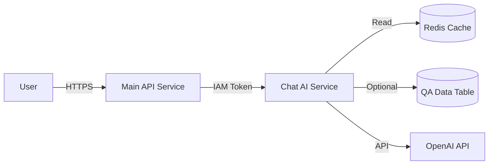

# Phase 2: Chat AI Service Extraction

**Phase:** 2 of 5
**Duration:** 3-4 days
**Priority:** High
**Status:** Not Started
**Dependencies:** Phase 1 (Codebase Preparation)

## Context

**Research Reports:**
- [FastAPI ML Patterns](./research/researcher-02-fastapi-ml-patterns.md) - ONNX optimization, model loading patterns
- [GCP Microservices](./research/researcher-01-gcp-microservices.md) - Service-to-service auth, Direct VPC Egress

**Current QA Service:**
- Location: `app/services/qa/` (decomposed structure)
- Components: `model_loader.py`, `dataset_loader.py`, `ai_summarizer.py`, `question_hasher.py`
- Facade: `app/services/qa_service.py` (legacy compatibility)
- Model: Vietnamese SBERT (~420MB in memory)
- Cold start: 10-15s (model loading blocking)

## Overview

Extract Q&A service into standalone Chat AI microservice with ONNX-optimized SBERT (2-5x faster), service-to-service HTTP communication, and independent deployment. Main API proxies Q&A requests to Chat AI service via HTTP+IAM.

## Key Insights from Research

**ONNX Optimization (Researcher-02):**
- SBERT with ONNX backend: 2-5x inference speedup
- Quantization (int8): Additional 30-40% speedup
- Model pre-loading at startup eliminates cold start penalty

**Service Communication (Researcher-01):**
- Direct VPC Egress: 2-5ms p95 latency (vs 15-30ms public)
- IAM identity tokens: Auto-refresh, no key rotation
- Connection pooling: Reuse HTTP session across requests

**Database Strategy:**
- Chat AI service: READ-ONLY access to `qa_data` table (if needed)
- Cache: Shared Redis instance (optional)
- No conversation/user table access (proxied via Main API)

## Requirements

**New Service Structure:**
```
chat_ai_service/
├── app/
│   ├── main.py                # FastAPI app entrypoint
│   ├── config.py              # Settings (separate from Main API)
│   ├── api/
│   │   └── qa.py              # Q&A endpoints
│   ├── services/
│   │   └── qa/                # Migrated from main app
│   │       ├── __init__.py
│   │       ├── model_loader.py
│   │       ├── dataset_loader.py
│   │       ├── ai_summarizer.py
│   │       └── question_hasher.py
│   └── core/
│       └── shared/            # Symlink to main app/core/shared/
├── tests/
│   ├── test_qa_api.py
│   └── test_qa_service.py
├── Dockerfile
├── requirements.txt
└── README.md
```

**Main API Changes:**
```python
# app/api/qa.py (updated to proxy)
@router.post("/api/v1/qa/ask")
async def ask_question(request: QARequest):
    """Proxy Q&A request to Chat AI service."""
    async with chat_ai_client.post("/ask", json=request.dict()) as response:
        return response
```

## Architecture Changes

**Before (Monolith):**
```
User → Main API /api/v1/qa/ask
         ↓
       QAService (in-process)
         ↓
       SBERT model (420MB)
         ↓
       Response
```

**After (Microservices):**
```
User → Main API /api/v1/qa/ask
         ↓ HTTP+IAM (Direct VPC Egress, 2-5ms)
       Chat AI Service /ask
         ↓
       SBERT-ONNX model (420MB)
         ↓
       Response
```

**Service Communication:**


## Related Code Files

**Files to Move:**
- `app/services/qa/` → `chat_ai_service/app/services/qa/`
- `app/services/qa_service.py` → `chat_ai_service/app/services/qa_service.py` (facade)
- `app/api/qa.py` → Split: Main API (proxy) + Chat AI (service)
- `app/schemas/qa.py` → Copy to `chat_ai_service/app/schemas/qa.py`

**Files to Create:**
- `chat_ai_service/app/main.py`
- `chat_ai_service/app/config.py`
- `chat_ai_service/Dockerfile`
- `chat_ai_service/requirements.txt`
- `main_api/app/clients/chat_ai_client.py` (HTTP client wrapper)

**Files to Update:**
- `app/main.py` - Remove QA service initialization, add HTTP client
- `app/config.py` - Add `CHAT_AI_SERVICE_URL` setting

## Implementation Steps

### 1. Create Chat AI Service Directory (Day 1)

**1.1 Create Structure:**
```bash
mkdir -p chat_ai_service/app/{api,services,core,schemas}
mkdir -p chat_ai_service/tests
touch chat_ai_service/app/__init__.py
```

**1.2 Create Main Application:**
```python
# chat_ai_service/app/main.py
"""Chat AI Service - Q&A with SBERT and OpenAI."""
import logging
from contextlib import asynccontextmanager
from fastapi import FastAPI
from fastapi.middleware.cors import CORSMiddleware

from .config import settings
from .api import qa
from .services.qa_service import QAService

logger = logging.getLogger(__name__)

@asynccontextmanager
async def lifespan(app: FastAPI):
    """Startup/shutdown lifecycle."""
    # Startup
    logger.info("Starting Chat AI Service...")

    # Initialize QA service with ONNX optimization
    try:
        app.state.qa_service = await QAService.create(
            settings,
            use_onnx=True,  # Enable ONNX backend
            quantize=True   # Enable int8 quantization
        )
        logger.info("QA service initialized with ONNX backend")
    except Exception as e:
        logger.error(f"Failed to initialize QA service: {e}")
        raise

    yield

    # Shutdown
    logger.info("Shutting down Chat AI Service...")
    # Cleanup if needed

app = FastAPI(
    title="VHealth Chat AI Service",
    version="1.0.0",
    lifespan=lifespan
)

# CORS
app.add_middleware(
    CORSMiddleware,
    allow_origins=settings.cors_origins,
    allow_credentials=True,
    allow_methods=["*"],
    allow_headers=["*"],
)

# Include routers
app.include_router(qa.router, prefix="/api/v1")

@app.get("/health")
async def health_check():
    """Health check endpoint."""
    qa_status = app.state.qa_service.get_service_status()
    return {
        "status": "healthy",
        "service": "chat_ai",
        "qa_service": qa_status
    }
```

**1.3 Create Configuration:**
```python
# chat_ai_service/app/config.py
"""Chat AI service configuration."""
from pydantic_settings import BaseSettings
from typing import List

class Settings(BaseSettings):
    """Chat AI service settings."""

    # Application
    app_name: str = "VHealth Chat AI Service"
    debug: bool = False

    # Q&A Service
    qa_model_path: str = "models/vietnamese-sbert"
    qa_data_path: str = "data/data.xlsx"
    qa_vocab_path: str = "data/tuvung.txt"
    qa_threshold: float = 0.55
    max_answers_per_field: int = 5

    # OpenAI
    openai_api_key: str
    openai_model: str = "gpt-4o-mini"
    openai_timeout: int = 30

    # GCS
    gcp_project_id: str = ""
    gcp_model_bucket: str = ""
    model_auto_download: bool = True

    # Redis Cache (optional)
    enable_redis_cache: bool = False
    redis_url: str = ""

    # CORS
    cors_origins: List[str] = ["*"]

    class Config:
        env_file = ".env"

settings = Settings()
```

### 2. Migrate QA Service with ONNX (Day 1-2)

**2.1 Update Model Loader for ONNX:**
```python
# chat_ai_service/app/services/qa/model_loader.py
"""SBERT model loader with ONNX optimization."""
from sentence_transformers import SentenceTransformer
import logging

logger = logging.getLogger(__name__)

class ModelLoader:
    """Load SBERT model with ONNX optimization."""

    def __init__(
        self,
        model_path: str,
        use_onnx: bool = True,
        quantize: bool = False
    ):
        self.model_path = model_path
        self.use_onnx = use_onnx
        self.quantize = quantize
        self.model = None

    async def initialize(self):
        """Load model asynchronously."""
        logger.info(f"Loading SBERT model from {self.model_path}")

        if self.use_onnx:
            # Use ONNX backend for 2-5x speedup
            self.model = SentenceTransformer(
                self.model_path,
                backend="onnx",  # Enable ONNX runtime
                cache_folder="/models/cache"
            )
            logger.info("SBERT model loaded with ONNX backend")

            if self.quantize:
                # Additional int8 quantization for 30-40% speedup
                logger.info("Applying int8 quantization...")
                self.model.export_optimized_onnx_model(
                    optimization_config="O3",
                    model_name_or_path="/models/quantized"
                )
                logger.info("Model quantized successfully")
        else:
            # Standard PyTorch backend
            self.model = SentenceTransformer(self.model_path)
            logger.info("SBERT model loaded with PyTorch backend")

    def encode(self, texts, batch_size=32):
        """Encode texts to embeddings."""
        return self.model.encode(
            texts,
            batch_size=batch_size,
            convert_to_numpy=True,
            show_progress_bar=False
        )
```

**2.2 Copy Other QA Components:**
```bash
# Copy decomposed components
cp -r app/services/qa/dataset_loader.py chat_ai_service/app/services/qa/
cp -r app/services/qa/ai_summarizer.py chat_ai_service/app/services/qa/
cp -r app/services/qa/question_hasher.py chat_ai_service/app/services/qa/
```

**2.3 Create QA API Endpoint:**
```python
# chat_ai_service/app/api/qa.py
"""Q&A API endpoints."""
from fastapi import APIRouter, Depends, Request
from fastapi.responses import StreamingResponse
from app.schemas.qa import QARequest, QAResponse

router = APIRouter(prefix="/qa", tags=["Q&A"])

def get_qa_service(request: Request):
    """Get QA service from app state."""
    return request.app.state.qa_service

@router.post("/ask", response_model=QAResponse)
async def ask_question(
    request: QARequest,
    qa_service = Depends(get_qa_service)
):
    """Ask health question."""
    response = await qa_service.ask_question(request.question)
    return response

@router.post("/ask/stream")
async def ask_question_stream(
    request: QARequest,
    qa_service = Depends(get_qa_service)
):
    """Ask question with streaming response."""
    async def event_stream():
        async for chunk in qa_service.ask_question_stream(request.question):
            yield f"data: {chunk}\n\n"

    return StreamingResponse(
        event_stream(),
        media_type="text/event-stream"
    )

@router.get("/health")
async def health_check(qa_service = Depends(get_qa_service)):
    """QA service health check."""
    return qa_service.get_service_status()
```

### 3. Update Main API to Proxy Requests (Day 2)

**3.1 Create Chat AI HTTP Client:**
```python
# app/clients/chat_ai_client.py
"""HTTP client for Chat AI service."""
from app.core.shared.http_client import ServiceClient
from app.config import settings

class ChatAIClient(ServiceClient):
    """Chat AI service client."""

    def __init__(self):
        super().__init__(
            base_url=settings.chat_ai_service_url,
            timeout=60  # Allow for model inference time
        )

    async def ask_question(self, question: str) -> dict:
        """Ask question to Chat AI service."""
        return await self.post("/api/v1/qa/ask", json={"question": question})

    async def ask_question_stream(self, question: str):
        """Ask question with streaming response."""
        session = await self._get_session()
        token = await self._get_iam_token()

        headers = {
            "Authorization": f"Bearer {token}",
            "Content-Type": "application/json"
        }

        url = f"{self.base_url}/api/v1/qa/ask/stream"
        async with session.post(url, json={"question": question}, headers=headers) as resp:
            async for line in resp.content:
                if line:
                    yield line.decode('utf-8')

# Singleton instance
chat_ai_client = ChatAIClient()
```

**3.2 Update Main API QA Router:**
```python
# app/api/qa.py (Main API)
"""Q&A API - Proxy to Chat AI service."""
from fastapi import APIRouter, HTTPException
from fastapi.responses import StreamingResponse
from app.schemas.qa import QARequest, QAResponse
from app.clients.chat_ai_client import chat_ai_client

router = APIRouter(prefix="/api/v1/qa", tags=["Q&A"])

@router.post("/ask", response_model=QAResponse)
async def ask_question(request: QARequest):
    """Ask health question (proxied to Chat AI service)."""
    try:
        response = await chat_ai_client.ask_question(request.question)
        return QAResponse(**response)
    except Exception as e:
        # Graceful degradation
        raise HTTPException(
            status_code=503,
            detail=f"Chat AI service unavailable: {str(e)}"
        )

@router.post("/ask/stream")
async def ask_question_stream(request: QARequest):
    """Ask question with streaming (proxied to Chat AI)."""
    async def event_stream():
        try:
            async for chunk in chat_ai_client.ask_question_stream(request.question):
                yield chunk
        except Exception as e:
            yield f"data: {{\"error\": \"{str(e)}\"}}\n\n"

    return StreamingResponse(
        event_stream(),
        media_type="text/event-stream"
    )
```

**3.3 Update Main API Configuration:**
```python
# app/config.py
class Settings(BaseSettings):
    # ... existing settings

    # Microservices
    chat_ai_service_url: str = "https://chat-ai-service-url.run.app"

    # ... rest
```

### 4. Create Chat AI Dockerfile (Day 2)

```dockerfile
# chat_ai_service/Dockerfile
FROM python:3.13-slim

# System dependencies for ONNX
RUN apt-get update && apt-get install -y --no-install-recommends \
    libgomp1 \
    && rm -rf /var/lib/apt/lists/*

# Create non-root user
RUN useradd --create-home --shell /bin/bash appuser

WORKDIR /home/appuser/app

# Copy requirements and install
COPY requirements.txt .
RUN pip install --no-cache-dir -r requirements.txt

# Copy application
COPY app/ ./app/

# Create directories for models
RUN mkdir -p /models/cache /models/quantized && \
    chown -R appuser:appuser /models

USER appuser

# Health check
HEALTHCHECK --interval=30s --timeout=10s --start-period=60s \
    CMD python -c "import requests; requests.get('http://localhost:8080/health')" || exit 1

EXPOSE 8080

CMD ["uvicorn", "app.main:app", "--host", "0.0.0.0", "--port", "8080"]
```

**requirements.txt:**
```
fastapi==0.115.0
uvicorn[standard]==0.32.0
sentence-transformers==5.1.2
onnxruntime==1.18.0  # ONNX runtime
optimum[onnxruntime]==1.20.0  # ONNX optimization
torch==2.5.1  # CPU version
openai==2.8.0
pandas==2.3.3
openpyxl==3.1.5
aiohttp==3.9.0
redis>=5.0.0
google-cloud-storage>=2.10.0
google-auth>=2.23.0
pydantic-settings>=2.0.0
```

### 5. Testing and Validation (Day 3-4)

**5.1 Local Testing:**
```bash
# Terminal 1 - Start Chat AI service
cd chat_ai_service
uvicorn app.main:app --port 8081 --reload

# Terminal 2 - Start Main API
uvicorn app.main:app --port 8080 --reload

# Terminal 3 - Test
curl -X POST http://localhost:8080/api/v1/qa/ask \
  -H "Content-Type: application/json" \
  -d '{"question": "What is BMI?"}'
```

**5.2 Performance Benchmarks:**
```python
# tests/benchmark_onnx.py
"""Benchmark ONNX vs PyTorch inference."""
import time
from sentence_transformers import SentenceTransformer

def benchmark_inference(model, texts, iterations=100):
    """Benchmark inference time."""
    start = time.time()
    for _ in range(iterations):
        model.encode(texts)
    elapsed = time.time() - start
    return elapsed / iterations

# PyTorch model
pytorch_model = SentenceTransformer("models/vietnamese-sbert")
pytorch_time = benchmark_inference(pytorch_model, ["What is BMI?"] * 10)

# ONNX model
onnx_model = SentenceTransformer(
    "models/vietnamese-sbert",
    backend="onnx"
)
onnx_time = benchmark_inference(onnx_model, ["What is BMI?"] * 10)

print(f"PyTorch: {pytorch_time:.3f}s")
print(f"ONNX: {onnx_time:.3f}s")
print(f"Speedup: {pytorch_time / onnx_time:.2f}x")
```

**5.3 Integration Tests:**
```python
# tests/test_chat_ai_integration.py
"""Integration tests for Chat AI service."""
import pytest
from httpx import AsyncClient

@pytest.mark.asyncio
async def test_ask_question_via_proxy():
    """Test Q&A through Main API proxy."""
    async with AsyncClient(base_url="http://localhost:8080") as client:
        response = await client.post(
            "/api/v1/qa/ask",
            json={"question": "What is BMI?"}
        )
        assert response.status_code == 200
        data = response.json()
        assert "answers" in data
        assert len(data["answers"]) > 0

@pytest.mark.asyncio
async def test_chat_ai_direct():
    """Test Chat AI service directly."""
    async with AsyncClient(base_url="http://localhost:8081") as client:
        response = await client.post(
            "/api/v1/qa/ask",
            json={"question": "What is BMI?"}
        )
        assert response.status_code == 200
```

### 6. Deploy Both Services (Day 4)

**6.1 Build Docker Images:**
```bash
# Build Chat AI service
cd chat_ai_service
docker build -t chat-ai-service:latest .

# Build Main API (updated)
cd ..
docker build -t main-api-service:latest .
```

**6.2 Deploy to Cloud Run (Manual):**
```bash
# Deploy Chat AI
gcloud run deploy chat-ai-service \
  --image gcr.io/PROJECT/chat-ai-service:latest \
  --platform managed \
  --region asia-southeast1 \
  --memory 1536Mi \
  --cpu 1 \
  --min-instances 1 \
  --max-instances 10 \
  --set-env-vars OPENAI_API_KEY=${OPENAI_API_KEY}

# Get Chat AI URL
CHAT_AI_URL=$(gcloud run services describe chat-ai-service --format='value(status.url)')

# Deploy Main API with Chat AI URL
gcloud run deploy main-api-service \
  --image gcr.io/PROJECT/main-api-service:latest \
  --platform managed \
  --region asia-southeast1 \
  --memory 512Mi \
  --cpu 1 \
  --min-instances 2 \
  --set-env-vars CHAT_AI_SERVICE_URL=${CHAT_AI_URL}
```

**6.3 Grant IAM Permissions:**
```bash
# Allow Main API to invoke Chat AI
gcloud run services add-iam-policy-binding chat-ai-service \
  --member=serviceAccount:main-api-sa@PROJECT.iam.gserviceaccount.com \
  --role=roles/run.invoker
```

## Todo List

- [ ] Create `chat_ai_service/` directory structure
- [ ] Create `chat_ai_service/app/main.py` with ONNX-enabled QA service
- [ ] Create `chat_ai_service/app/config.py`
- [ ] Migrate `app/services/qa/` to `chat_ai_service/app/services/qa/`
- [ ] Update `model_loader.py` for ONNX optimization
- [ ] Create Chat AI API endpoints in `chat_ai_service/app/api/qa.py`
- [ ] Create Chat AI Dockerfile with ONNX dependencies
- [ ] Create `chat_ai_service/requirements.txt`
- [ ] Create `app/clients/chat_ai_client.py` in Main API
- [ ] Update Main API `app/api/qa.py` to proxy requests
- [ ] Add `chat_ai_service_url` to Main API config
- [ ] Update Main API `app/main.py` (remove QA service init)
- [ ] Create ONNX benchmark script
- [ ] Run ONNX vs PyTorch benchmarks (verify 2-5x speedup)
- [ ] Create integration tests for proxy flow
- [ ] Test local setup (both services running)
- [ ] Build Chat AI Docker image
- [ ] Build updated Main API Docker image
- [ ] Deploy Chat AI service to Cloud Run
- [ ] Configure IAM permissions for service-to-service auth
- [ ] Deploy updated Main API service
- [ ] Run smoke tests on production
- [ ] Validate latency < 50ms for proxy requests
- [ ] Monitor cold start time (target: Chat AI <5s)

## Success Criteria

**Performance:**
- SBERT ONNX inference 2-5x faster than PyTorch
- Chat AI cold start < 5s
- Service-to-service latency < 50ms (p95)
- Main API cold start < 1s (QA service removed)

**Reliability:**
- Zero downtime deployment
- Graceful degradation if Chat AI unavailable
- All Q&A tests passing

**Cost:**
- Chat AI: 1 min instance (~$3.46/day)
- Main API memory reduced to 512MB

## Risk Assessment

**ONNX Compatibility:**
- Risk: Model incompatibility with ONNX
- Mitigation: Test ONNX conversion in dev first
- Fallback: Use PyTorch backend

**Service Communication Overhead:**
- Risk: HTTP latency > 50ms
- Mitigation: Direct VPC Egress + connection pooling
- Validation: Load testing

**Database Connection Limits:**
- Risk: Chat AI overloads Cloud SQL
- Mitigation: Reduce pool to 5 connections; use cache
- Validation: Monitor connection count

## Security Considerations

**IAM Authentication:**
- Chat AI requires valid IAM token from Main API
- Token auto-refreshes every 5 minutes
- Audit logs for all service-to-service calls

**Secrets Management:**
- OpenAI API key in Secret Manager
- No hardcoded credentials
- Each service loads secrets independently

**Network Security:**
- Direct VPC Egress (private IP routing)
- No public database access
- HTTPS only

## Next Steps

**After Phase 2 Completion:**
- Phase 3: Extract Prediction service
- Phase 3: Convert sklearn models to ONNX
- Monitor Chat AI service performance and cost
